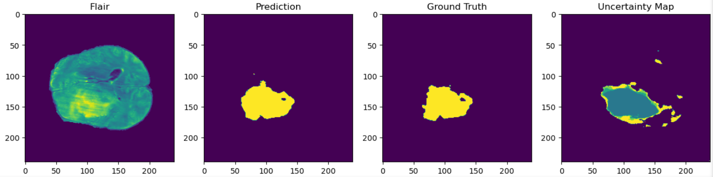

# Brain Tumor Segmentation with Deep Learning and Deep Ensembles

This project focuses on brain tumor segmentation using a deep learning model implemented in TensorFlow and Keras. The goal is to identify and segment brain tumors from MRI scans, a crucial step in medical image analysis.



## Project Structure

- `brain-tumor-segmentation.ipynb` - The main Jupyter notebook containing all the steps from preprocessing to model evaluation.
- `README.md` - Overview and instructions for the project.
- `data/` - Folder where the dataset should be placed (not included in the repository).
- `models/` - Saved models and checkpoints (optional).

## Features

- Preprocessing of MRI images (e.g. resizing, normalization)
- U-Net-based architecture for semantic segmentation
- Dice coefficient and binary cross-entropy loss for training
- Visualizations of predictions vs. ground truth

## Requirements

- Python 3.7+
- Jupyter Notebook
- TensorFlow >= 2.x
- NumPy
- Matplotlib
- OpenCV
- scikit-learn

## Dataset
The notebook expects brain MRI images with corresponding segmentation masks.
You can use publicly available datasets like:

- BraTS Challenge Dataset
- Kaggle datasets for brain MRI images

Ensure your dataset is structured like this:
```
data/
├── images/
│   ├── patient1.png
│   └── ...
└── masks/
    ├── patient1_mask.png
    └── ...
```

## Usage
1. Clone the repo and navigate to the folder:

```console
git clone https://github.com/yourusername/brain-tumor-segmentation.git
cd brain-tumor-segmentation
```

2. Launch the notebook:
```console
jupyter notebook brain-tumor-segmentation.ipynb
```

3. Follow along in the notebook to:
- Load the dataset
- Train the model
- Visualize predictions

## Results
Sample output:
- Dice Score: ~0.85 (varies based on dataset and training)
- Segmentation outputs displayed as side-by-side comparisons

## Future Improvements
- Add data augmentation
- Hyperparameter tuning

